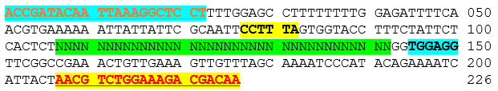
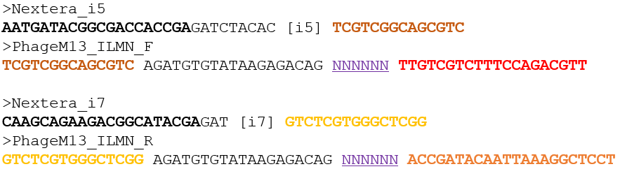

# PhageSeeker - A suite for M13 phage display NGS data analysis.

Authors: Taejoon Kwon (tkwon@unist.ac.kr)

## Phage M13 Genomes
* [PhageM13_genome.V00504.fa](resources/PhageM13_genome.V00504.fa) - from https://www.ebi.ac.uk/ena/browser/view/V00604.2
* [PhageM13_genome.JX412914.fa](resources/PhageM13_genome.JX412914.fa) - from https://www.ebi.ac.uk/ena/browser/view/JX412914.1

## Phage M13 variable region for screening

* Green: a variable region (12 amino acids == 36 nucleotides)
* Red: a target of PhageM13_ILMN_F
* Orange: a target of PhageM13_ILMN_R
* Yellow/Cyan : a pair of reads with 2x150bp sequencing (a bold hexamer will be dropped due to the UMI). 

## Primers for Phage M13 variable region amplification & the library prep.

* Nextera_i5, Nextera_i7 - a pair of conventional Illumina Nextera barcode adapters.
* PhageM13_ILMN_F & PhageM13_ILMN_R - a pair of primers for phage M13 variable region amplification.
* 'NNNNNN' - a hexamer used for UMI (to estimate the amplification bias)

## Ref
* ipcress (for in silico PCR): https://www.ebi.ac.uk/about/vertebrate-genomics/software/ipcress-manual
